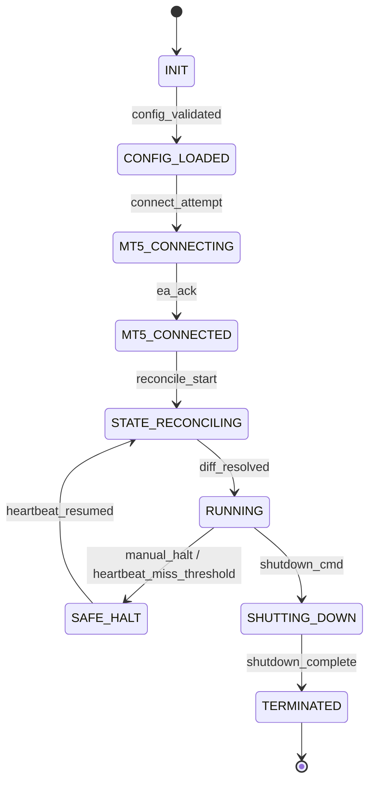

# Architecture — Standardised Machine Learning Trading System

Cocoon implements a standardised architecture for ML trading systems: six
strictly-layered modules from raw OHLCV to broker execution, one CLI as the
composition root, and one broker contract that makes backtest, paper, and
live runs share the same decision code. Diagram source: `ARCHITECTURE.mmd`.

## 1. Invariants

Non-negotiable properties; every component is shaped by them.

| Invariant | Mechanism |
| --------- | --------- |
| **Causality** | Every feature computes on a frame sliced to `[0, t]` *before* the feature function runs. No feature can see the future, structurally. |
| **Determinism** | Datasets (`ds_*`), model runs (`<model>_<hash>`), and backtests (`bt_*`) are content-hashed; identical inputs → byte-identical IDs. No wall-clock branching in the compute path. |
| **Backtest/live parity** | Signal, risk, portfolio, and order engines are the same instances in every mode; only the `BrokerAdapter` implementation changes (ZMQ bridge vs. simulator). |
| **Auditability** | Every order, signal, state transition, and error is appended to `logs/audit.jsonl` with a monotonic `seq`, mirrored into SQLite. Every failure exits with a catalogued code. |
| **Layering** | Imports only point downward (L5→L0), enforced by an import-time tripwire (`_layering.py`). |

## 2. Layer map

```
src/cocoon/
  core/         L0  config · logging+audit · errors/exit codes · state machine · interfaces
  data/         L1  parquet cache · ring buffer · importer · features (SMC/TA/context) · labeling · dataset builder
  ml/           L2  model adapters · training (purged walk-forward + Optuna) · hash registry · inference
  trading/      L3  signal · risk · portfolio · order · reconciliation · backtest + simulated broker
  bridge/       L4  msgpack protocol · ZMQ endpoint · heartbeat · ZmqBrokerAdapter
  cli/          L5  typer commands · menu · dashboards · composition root
  persistence/  —   SQLAlchemy models/repos · audit→DB mirror   (unlayered; imports core only)
  plugins/      —   entry-point + local-file feature plugins
mql5/           —   CocoonEA.mq5 + includes (EA skeleton; JSON today, msgpack required for live)
```

Concrete implementations bind to interfaces **only** in the CLI composition
root; `trading/*` never imports a concrete broker.

## 3. Data flow

**Training path (offline, deterministic):**
CSV/Parquet/MT5 → parquet cache → causal feature pass (O(n) full-frame) →
forward-return labels (horizon + deadband) → content-hashed dataset →
purged walk-forward training (+ optional HPO) → hash-registered model →
stage promotion (`production` exclusive per model name).

**Decision path (identical in backtest/paper/live):**
bar → ring-buffer window → point-in-time features → inference P(up) →
signal (confidence threshold, regime filter) → risk (sequenced checks
against staleness-gated portfolio state) → order intent.

**Execution path:**
order intent → idempotency key → `BrokerAdapter.submit_order` → lifecycle
persistence (SQLite) + audit record. Live: msgpack over ZMQ to the MT5 EA.
Backtest/paper: `SimulatedBrokerAdapter` (fills next-open ± slippage in
backtest, bar-close ± slippage in paper replay; SL/TP on bar range,
conservative).

**Window discipline:** live seeds the ring buffer from the cache (warm
lookback); paper replay resets it to empty so replayed bars arrive strictly
in order — the cache *is* the future, seeding it would leak it.

## 4. Runtime state machine



Every transition is audited. Control is file-based
(`data/runtime/state.json`, `control.json`): `halt/resume/stop` work from any
terminal, no daemon. SAFE_HALT blocks new trades but keeps ingesting bars so
the feature window is warm on resume.

## 5. Order lifecycle

```
INTENT → RISK_APPROVED|RISK_REJECTED → SUBMITTED
       → ACKNOWLEDGED | FILLED | PARTIALLY_FILLED | REJECTED_BY_BROKER
       → SUBMIT_TIMEOUT → RETRYING (bounded backoff) → FAILED_PERMANENT (exit 41)
```

Idempotency key = `symbol + direction + signal_ts + model_version_hash`: a
duplicate submit returns the cached result and hits the broker exactly once.
Fills upsert positions (SQLite) and force a portfolio resync so the next risk
decision sees them.

**Reconciliation (startup):** broker positions/orders diffed against SQLite
by ticket — match → proceed; broker-only → import as `origin=external`
(never auto-closed); local-only order → `FAILED_PERMANENT`; unresolved
conflict → exit 21 (paper mode instead auto-closes stale local paper
positions).

## 6. Contracts

| Contract | Definition |
| -------- | ---------- |
| `BrokerAdapter` (L0 ABC) | `connect/disconnect/is_connected/last_heartbeat`, `submit_order/cancel_order/modify_order`, `get_positions/get_orders`, `subscribe_bars`. Implemented by `bridge.ZmqBrokerAdapter` (live) and `trading.backtest.SimulatedBrokerAdapter` (backtest/paper). |
| Feature function | Registered `FeatureFn` with a stable name; registration order **is** the feature-vector column order everywhere. Plugins extend the catalogue at runtime. |
| Wire protocol | msgpack envelope `{v, type, ts, session_id, payload}`, `PROTOCOL_VERSION = 1`; types HELLO/ACK/HEARTBEAT/BAR_CLOSED/TICK/ORDER_SUBMIT/ORDER_RESULT/ORDER_CANCEL/ORDER_MODIFY/POSITIONS_*/ORDERS_*/ERROR. Version mismatch fails fast (exit 50). |
| Config | Strict pydantic (`extra="forbid"`); precedence defaults → `base.yaml` → profile → `COCOON_SECTION__KEY` env. |
| Exit codes | Single catalogue: 0, 1, 10, 11, 20, 21, 30, 31, 32, 40, 41, 50, 60, 130. No literal exit integers outside it. |
| CLI output | Results are themed tables on stdout with a byte-stable `--output json` twin; logs/errors on stderr (see `TERMINAL_V2.md`). |

## 7. Execution modes

| | Backtest | Paper | Live |
| --- | --- | --- | --- |
| Broker | simulator | simulator | ZMQ bridge → MT5 EA |
| Bars | full cached frame | cached bars replayed chronologically, paced by `--speed` | EA PUB stream |
| Features | one full-frame pass | point-in-time on empty-seeded window | point-in-time on cache-seeded window |
| Fill price | next-bar open ± slippage | bar close ± slippage | market at broker |
| Account state | local equity accumulation | portfolio engine, PnL fed back (breakers live) | portfolio engine ⇄ broker |
| Decision code | **identical** | **identical** | **identical** |
| Requires MT5 | no | no | yes (msgpack-capable EA) |

## 8. Persistence & observability

- **SQLite** (`data/cocoon.db`): orders (by idempotency key), positions (by
  ticket, `internal|external`), model runs (stage), audit-event mirror.
- **`logs/audit.jsonl`**: authoritative append-only audit stream; `seq`
  monotonic across restarts; DB mirror is best-effort and never blocks the
  trading loop.
- **`logs/app.log`**: rotating structured app log; stderr mirrors it except
  while a live dashboard owns the terminal.
- **Artifacts on disk**: `data/raw/` cache, `data/features/`,
  `data/datasets/`, `data/models/`, `data/backtests/`, `data/runtime/`.
